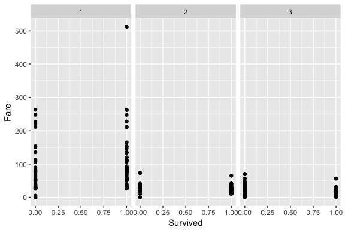
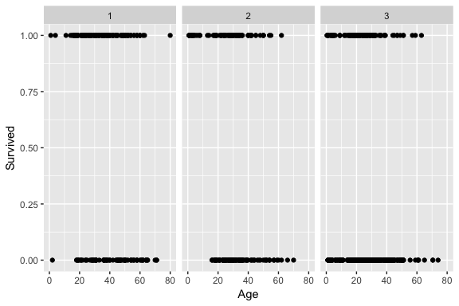
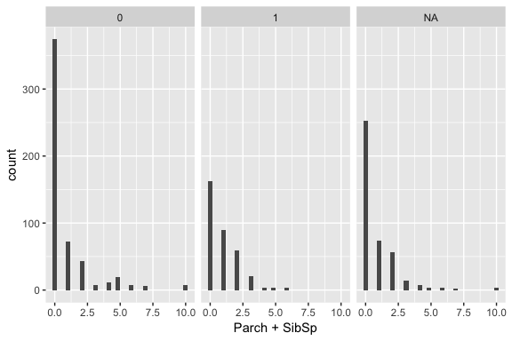
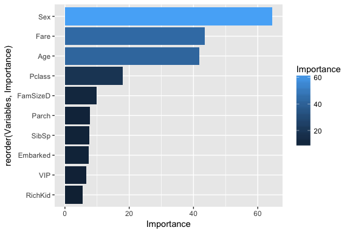

Loading data
============

The training and test data for this classification problem is loaded
from the kaggle website.

    # Create the environment
    library(dplyr)

    ## 
    ## Attaching package: 'dplyr'

    ## The following objects are masked from 'package:stats':
    ## 
    ##     filter, lag

    ## The following objects are masked from 'package:base':
    ## 
    ##     intersect, setdiff, setequal, union

    library(ggplot2)
    library(mice)
    library(randomForest)

    ## randomForest 4.6-12

    ## Type rfNews() to see new features/changes/bug fixes.

    ## 
    ## Attaching package: 'randomForest'

    ## The following object is masked from 'package:ggplot2':
    ## 
    ##     margin

    ## The following object is masked from 'package:dplyr':
    ## 
    ##     combine

    library(e1071)

    # Loading the data
    train<-tbl_df(read.csv("train.csv", header = TRUE, stringsAsFactors = F))
    test<-tbl_df(read.csv("test.csv", header = TRUE, stringsAsFactors = F))
    full<- bind_rows(train, test)

    summary(full)

    ##   PassengerId      Survived          Pclass          Name          
    ##  Min.   :   1   Min.   :0.0000   Min.   :1.000   Length:1309       
    ##  1st Qu.: 328   1st Qu.:0.0000   1st Qu.:2.000   Class :character  
    ##  Median : 655   Median :0.0000   Median :3.000   Mode  :character  
    ##  Mean   : 655   Mean   :0.3838   Mean   :2.295                     
    ##  3rd Qu.: 982   3rd Qu.:1.0000   3rd Qu.:3.000                     
    ##  Max.   :1309   Max.   :1.0000   Max.   :3.000                     
    ##                 NA's   :418                                        
    ##      Sex                 Age            SibSp            Parch      
    ##  Length:1309        Min.   : 0.17   Min.   :0.0000   Min.   :0.000  
    ##  Class :character   1st Qu.:21.00   1st Qu.:0.0000   1st Qu.:0.000  
    ##  Mode  :character   Median :28.00   Median :0.0000   Median :0.000  
    ##                     Mean   :29.88   Mean   :0.4989   Mean   :0.385  
    ##                     3rd Qu.:39.00   3rd Qu.:1.0000   3rd Qu.:0.000  
    ##                     Max.   :80.00   Max.   :8.0000   Max.   :9.000  
    ##                     NA's   :263                                     
    ##     Ticket               Fare            Cabin          
    ##  Length:1309        Min.   :  0.000   Length:1309       
    ##  Class :character   1st Qu.:  7.896   Class :character  
    ##  Mode  :character   Median : 14.454   Mode  :character  
    ##                     Mean   : 33.295                     
    ##                     3rd Qu.: 31.275                     
    ##                     Max.   :512.329                     
    ##                     NA's   :1                           
    ##    Embarked        
    ##  Length:1309       
    ##  Class :character  
    ##  Mode  :character  
    ##                    
    ##                    
    ##                    
    ## 

Imputing missing data
---------------------

Looking at the data summary we see that the *Age* variable still has a
considerable amount of missing values. We could drop these observations,
however, this would significantly reduce our data set by 263. Hence, we
wish to impute these values. One possibility to do that is by using the
Multivariate Imputation by Chained Equations (MICE) library.

    imp <- mice(full[, !names(full) %in% c('PassengerId','Name','Ticket','Cabin', 'Survived')], method='rf')

    ## 
    ##  iter imp variable
    ##   1   1  Age  Fare
    ##   1   2  Age  Fare
    ##   1   3  Age  Fare
    ##   1   4  Age  Fare
    ##   1   5  Age  Fare
    ##   2   1  Age  Fare
    ##   2   2  Age  Fare
    ##   2   3  Age  Fare
    ##   2   4  Age  Fare
    ##   2   5  Age  Fare
    ##   3   1  Age  Fare
    ##   3   2  Age  Fare
    ##   3   3  Age  Fare
    ##   3   4  Age  Fare
    ##   3   5  Age  Fare
    ##   4   1  Age  Fare
    ##   4   2  Age  Fare
    ##   4   3  Age  Fare
    ##   4   4  Age  Fare
    ##   4   5  Age  Fare
    ##   5   1  Age  Fare
    ##   5   2  Age  Fare
    ##   5   3  Age  Fare
    ##   5   4  Age  Fare
    ##   5   5  Age  Fare

    imp_data <- tbl_df(complete(imp))

    par(mfrow=c(1,2))
    hist(train$Age, freq=F, main='Age: data', 
      col='red', ylim=c(0,0.04))
    hist(train$Age, freq=F, main='Age: imputed data', 
      col='blue', ylim=c(0,0.04))

As can be seen from our plot, the pattern of the imputed *Age* values
fit the original data very well. For the following analysis, we will
therefore replace the missing data values with the imputed data.

    full$Age<-imp_data$Age
    full$Embarked<-imp_data$Embarked
    full$Fare<-imp_data$Fare

Feature engineering
-------------------

### High fares save lives in first and second class

Looking at the survival as a function of the fare broken down into
passenger class, we see that survival chance in 1st and 2nd class is
higher when paying a higher fare. This can be also seen in detail when
calculating the respective distibution medians.

    g<-ggplot(full, aes(Survived, Fare))+geom_point()+facet_grid(.~as.factor(full$Pclass))
    print(g)

    ## Warning: Removed 418 rows containing missing values (geom_point).

Hence it appears usfeful to create a VIP variable, that considers this
relation.

    full %>% mutate(VIP=ifelse(((Pclass==1 & Fare>median(Fare[Pclass==1 & Survived==1], na.rm = TRUE)) | (Pclass==2 & Fare>median(Fare[Pclass==2 & Survived==1], na.rm = TRUE))), TRUE, FALSE))->full

Looking at the table *Survival* vs. *Fare* we can clearly see that
paying more money saves your life:

    table(full$VIP, full$Survived)

    ##        
    ##           0   1
    ##   FALSE 497 233
    ##   TRUE   52 109

### Rich kids live longer

Looking at the *Survival* as a function of age broken down into
*Pclass*, we see that it is always good to be a rich kid:

    g<-ggplot(full, aes(Age, Survived))+geom_point()+facet_grid(.~as.factor(full$Pclass))
    print(g)

    ## Warning: Removed 418 rows containing missing values (geom_point).

While kids from 1st and 2nd class basically always survive if they are
15 years old or younger, it doesn't make much of a difference if you are
more from the low income range. Hence, we'll create a variable to
account for the rich kid factor:

    full %>% mutate(RichKid=ifelse((Pclass==1 & Age<19) | (Pclass==2 & Age<15), TRUE, FALSE))->full

As we can see from the table,

    table(full$RichKid, full$Survived)

    ##        
    ##           0   1
    ##   FALSE 546 308
    ##   TRUE    3  34

it pays off to have wealthy parents that can afford a fancy ride on the
Titanic.

### Family size

Speaking of rich kids, it may be interesting to see whether families had
a survival bonus, when that ship started sinking. From an ethical point
of view, a single man may die the honorable death in the cold sea whilst
saving a young family or so, at least in the old times. Anyway, let's
have a look at the family size variables *Parch* and *SibSp*:

    g<-ggplot(full, aes(Parch+SibSp))+geom_histogram()+facet_grid(.~as.factor(full$Survived))
    print(g)

    ## `stat_bin()` using `bins = 30`. Pick better value with `binwidth`.

As can be seen, being single may have given you a joyful time at the
Titanic's bars, yet it is penalized regarding the survival chance. You
want to travel with at least one but not more than two family companions
in order to have a good survival chance. Let us put this observtion into
a new variable *FamSize*, which we discretize to account for that
particular size window.

    full %>% mutate(FamSize=Parch+SibSp+1)->full
    full$FamSizeD[full$FamSize == 1] <- 'single'

    ## Warning: Unknown column 'FamSizeD'

    full$FamSizeD[full$FamSize < 5 & full$FamSize > 1] <- 'small'
    full$FamSizeD[full$FamSize > 4] <- 'large'

Looking at the corresponding table,

    table(full$FamSizeD, full$Survived)

    ##         
    ##            0   1
    ##   large   52  10
    ##   single 374 163
    ##   small  123 169

it becomes obvious that both singles and members of larger families may
have a hard time surviving.

Building a model
================

Let us first convert all of our variables into factors such that they
become suitable as predictive model input.

    fac<-c('PassengerId','Pclass','Sex','Embarked','FamSizeD', 'SibSp', 'Parch', 'RichKid', 'VIP')
    full[fac] <- lapply(full[fac], function(x) as.factor(x))

Let us create some training and test data set's from the *train* data
frame so that we can train and tune our model by using cross validation.

    train.ext <- full[1:891,]
    test.ext <- full[892:1309,]

    index <- 1:nrow(train.ext)
    testindex <- sample(index, trunc(length(index)/3))
    testset <- train.ext[testindex,]
    trainset <- train.ext[-testindex,]

Random Forest Model
-------------------

Let us start by building a prediction model that uses a randon forest
algorithm, where the classification is based on a decision tree:

    rf.model<- randomForest(as.factor(Survived)~Pclass+Sex+SibSp+Age+Fare+Parch+Embarked+VIP+RichKid+FamSizeD, data=trainset)

Looking at the importance of the individual variables we see that *Sex*,
*Age* and *Fare* are the most relevant categories upon which survival or
death depends.

    importance<-importance(rf.model)
    varImportance <- data.frame(Variables = row.names(importance), 
                                Importance = importance[ ,'MeanDecreaseGini'])
    p<-ggplot(varImportance, aes(x = reorder(Variables, Importance), 
        y = Importance, fill = Importance)) +
      geom_bar(stat='identity') + coord_flip()
    print(p)

Now let us make use of our model and predict an outcome. We also make a
confusion table to have a look on the quality of our model.

    prediction <- predict(rf.model, testset)
    rf.tab<-table(pred=prediction, true = testset$Survived)
    print(rf.tab)

    ##     true
    ## pred   0   1
    ##    0 158  31
    ##    1  20  88

That confusion table looks already fairly good.

SVM model
---------

Let's take a different route and usea SVM algorithm, which classifies by
maximizing the decision boundary distance. Since number of *variables* n
is relatively small on the order of 10 and number of observations is not
very large on the order of 100, we want to use a radial kernel.

    svm.model<- svm(as.factor(Survived)~Pclass+Sex+SibSp+Age+Fare+Parch+Embarked+VIP+RichKid+FamSizeD, data=trainset, kernel="radial")

Let's predict some values and look at the confusion table

    svm.prediction <- predict(svm.model, testset[,-2])
    svm.tab<-table(pred=svm.prediction, true = testset$Survived)
    print(svm.tab)

    ##     true
    ## pred   0   1
    ##    0 149  31
    ##    1  29  88

As can be seen, our model still falls short compared to the random
forest model. Let us run some cross validation test to enhance the
quality of our model.

    tuned <- tune.svm(as.factor(Survived)~Pclass+Sex+SibSp+Age+Fare+Parch+Embarked+VIP+RichKid+FamSizeD, data = trainset, gamma = 10^(-6:-1), cost = 10^(1:2), kernel="radial")

    summary(tuned)

    ## 
    ## Parameter tuning of 'svm':
    ## 
    ## - sampling method: 10-fold cross validation 
    ## 
    ## - best parameters:
    ##  gamma cost
    ##   0.01  100
    ## 
    ## - best performance: 0.1783051 
    ## 
    ## - Detailed performance results:
    ##    gamma cost     error dispersion
    ## 1  1e-06   10 0.3753955 0.07003529
    ## 2  1e-05   10 0.3753955 0.07003529
    ## 3  1e-04   10 0.3687006 0.06865586
    ## 4  1e-03   10 0.2203107 0.06656304
    ## 5  1e-02   10 0.1899718 0.05996472
    ## 6  1e-01   10 0.1951130 0.08119415
    ## 7  1e-06  100 0.3753955 0.07003529
    ## 8  1e-05  100 0.3687006 0.06865586
    ## 9  1e-04  100 0.2203107 0.06656304
    ## 10 1e-03  100 0.1967514 0.05343428
    ## 11 1e-02  100 0.1783051 0.06090347
    ## 12 1e-01  100 0.2322316 0.05373579

Since we know now the ideal parameters, we can set up a tuned model and
make an updated prediction:

    model.tuned<- svm(as.factor(Survived)~Pclass+Sex+SibSp+Age+Fare+Parch+Embarked+VIP+RichKid+FamSizeD, data=trainset, gamma=0.01, cost=100, kernel="radial")

    prediction.tuned <- predict(model.tuned, testset[,-2])
    tab.tuned<-table(pred=prediction.tuned, true = testset$Survived)
    print(tab.tuned)

    ##     true
    ## pred   0   1
    ##    0 154  32
    ##    1  24  87

That looks already much better than the non-tuned model and gives
similar quality of prediction as the random forest model.

Predicting outcome and submit solution
======================================

Since the random forest model yields slightly better prediction that the
SVM model, we will use it for the final prediction ont the test set.

    final.prediction<-predict(rf.model, test.ext)

    submission <- data.frame(PassengerID = test.ext$PassengerId, Survived = final.prediction)
    write.csv(submission, file = 'titanic_solution.csv', row.names = F)
